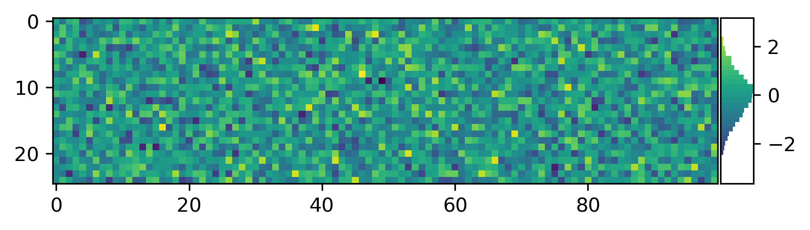
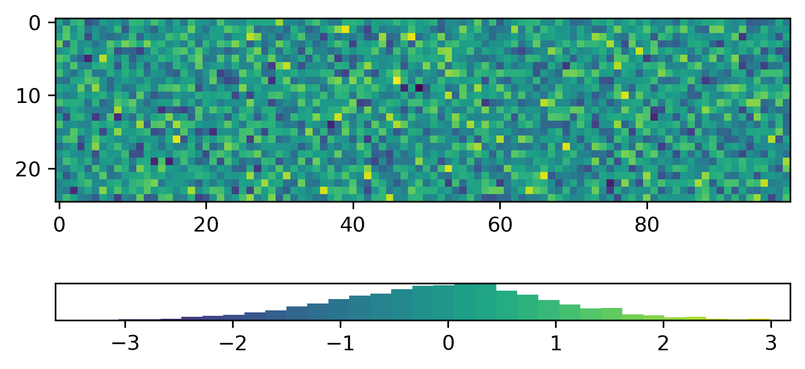

.. mpl-histcolorbar documentation master file, created by
   sphinx-quickstart on Tue May 16 11:39:23 2023.
   You can adapt this file completely to your liking, but it should at least
   contain the root `toctree` directive.

mpl-histcolorbar: a histogram + colorbar for matplotlib
============================================

Installation
------------

mpl-histcolorbar is available on PyPI and can be installed with pip::

    pip install mpl-histcolorbar

or with conda::

    conda install -c conda-forge mpl-histcolorbar

Dependencies
^^^^^^^^^^^^
- `numpy <http://www.numpy.org/>`_
- `matplotlib <http://matplotlib.org/>`_

Basic usage
-----------
The class :code:`HistColorbar` is designed to be a drop-in replacement for matplotlib's :code:`Colorbar`:

.. code-block:: python

    import numpy as np
    import matplotlib.pyplot as plt
    from mpl_toolkits.axes_grid1.axes_divider import make_axes_locatable
    from mpl_histcolorbar import HistColorbar

    # Generate some data
    rng = np.random.default_rng(seed=42)
    data = rng.standard_normal(size=(25, 100))

    # Plot an image
    fig, ax = plt.subplots()
    im = ax.imshow(data)

    # Create an axis for the HistColorbar
    divider = make_axes_locatable(ax)
    cax = divider.append_axes("right", size="5%", pad=0.02)

    # Add the HistColorbar
    hcb = HistColorbar(cax, im)

A :code:`Colorbar` in matplotlib is often created by calling the :code:`colorbar` method
of a :code:`Figure`. mpl-histcolorbar provides an equivalent function
:code:`histcolorbar`, which takes a :code:`Figure` object as its first argument:

.. code-block:: python

    import numpy as np
    import matplotlib.pyplot as plt
    from mpl_histcolorbar import histcolorbar

    # Generate some data
    rng = np.random.default_rng(seed=42)
    data = rng.standard_normal(size=(25, 100))

    # Plot an image
    fig, ax = plt.subplots()
    im = ax.imshow(data)

    # Add the HistColorbar
    hcb = histcolorbar(fig, im, location="bottom")

.. toctree::
   :maxdepth: 2
   :caption: Contents:

   usage
   contributing
   api
   ...

Indices and tables
==================

* :ref:`genindex`
* :ref:`modindex`
* :ref:`search`
