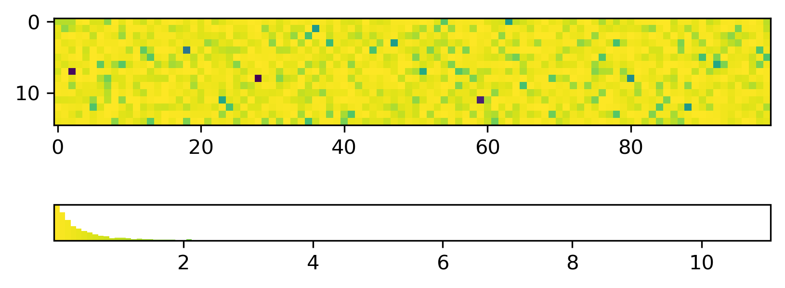
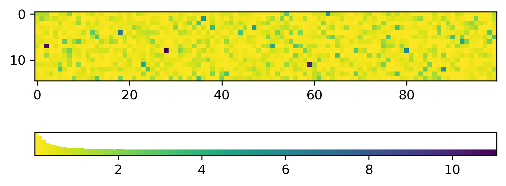

.. mpl-histcolorbar usage

Usage
=============

Basic usage of the :code:`HistColorbar` class and :code:`histcolorbar` function is
shown on the index page of the documentation.

By default, the :code:`HistColorbar` class will draw a histogram using the mappable's
colormap. If the histogram is heavily weighted, it may be hard to see the full
spectrum of the colormap.

.. code-block:: python

    import numpy as np
    import matplotlib.pyplot as plt
    from mpl_histcolorbar import histcolorbar

    # Generate some data
    rng = np.random.default_rng(seed=42)
    data = rng.pareto(a=3, size=(25, 100))

    # Plot an image
    fig, ax = plt.subplots()
    im = ax.imshow(data)

    # Add the HistColorbar
    hcb = histcolorbar(fig, im, location="bottom")

To still see the full colormap in the histcolorbar, you can call
:code:`HistColorbar` with the :code:`separate_hist=True` keyword argument.
This will draw the histogram on top of a traditional colorbar. The
relative scale of the histogram and colorbar in the histcolorbar can be adjusted with
the :code:`hist_fraction` keyword argument. The default value is 0.5:

.. code-block:: python

    import numpy as np
    import matplotlib.pyplot as plt
    from mpl_histcolorbar import histcolorbar

    # Generate some data
    rng = np.random.default_rng(seed=42)
    data = rng.pareto(a=3, size=(25, 100))

    # Plot an image
    fig, ax = plt.subplots()
    im = ax.imshow(data)

    # Add the HistColorbar
    hcb = histcolorbar(fig, im, location="bottom", separate_hist=True, hist_fraction=0.75)

To better distinguish between the histogram and colorbar parts of the histcolorbar,
an arbitrary solid color can be chosen for the histogram:

.. code-block:: python

    import numpy as np
    import matplotlib.pyplot as plt
    from mpl_histcolorbar import histcolorbar

    # Generate some data
    rng = np.random.default_rng(seed=42)
    data = rng.pareto(a=3, size=(25, 100))

    # Plot an image
    fig, ax = plt.subplots()
    im = ax.imshow(data)

    # Add the HistColorbar
    hcb = histcolorbar(fig, im, location="bottom", separate_hist=True,
                       hist_fraction=0.75, hist_color="red")

.. image:: _static/pareto_example_with_cb_red.png
  :width: 800
  :alt: Example of a heavily weighted black histogram with a colorbar

